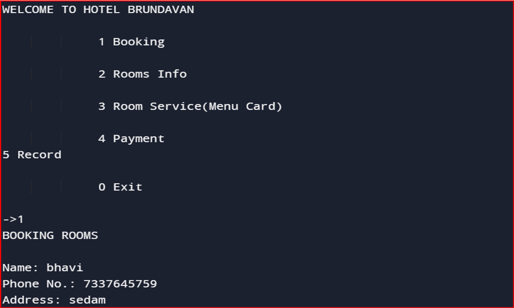

Staycation Management System 🏨

A console-based Hotel Management System developed using Python. This project helps manage room bookings, restaurant services, and payment processing for a fictional hotel named **Hotel Brundavan**.

Features

- 📅 Room Booking
  Allows customers to book rooms with check-in/check-out date validation and room type selection.

- 🍽️ Restaurant Menu & Billing
  Includes a built-in restaurant menu with itemized ordering and billing system.

- 💳 Payment Handling 
  Calculates total charges (room + food) and simulates payment with multiple modes.

- 📋 Customer Records
  Displays a tabular record of all bookings and related details during program runtime.

🛠️ Tech Stack

- Python 3.x
- No external libraries required (uses only built-in modules like `random` and `datetime`)

🚀 How to Run

1. Clone the repository:
   ```bash
   git clone https://github.com/Bhavi64/Staycation-Management-System.git

2. Navigate to the folder:
   cd Staycation-Management-System

3. Run the application:
    python Staycation.py

📸 Screenshots

(Picture2.png)
(Picture3.png)
(Picture4.png)
(Picture5.png)
(Picture6.png)


   
